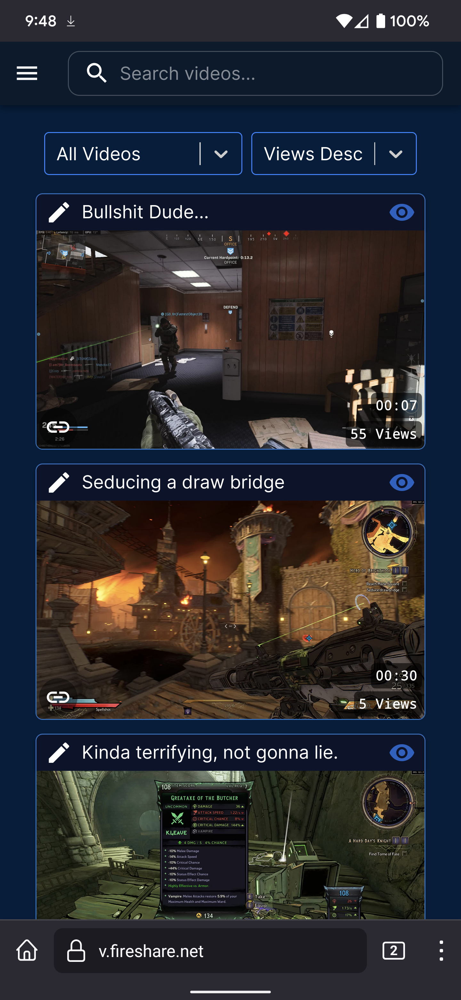

<!-- PROJECT LOGO -->
<br />
<p align="center">
  <a href="https://github.com/ShaneIsrael/fireshare">
    
  </a>

  <h1 align="center">Fireshare</h1>

  <p align="center">
    Share your game clips, videos, or other media via unique links.
    <br />
    <br />
    <a href="https://github.com/shaneisrael/fireshare/actions">
      
    </a>
    <a href="https://hub.docker.com/r/shaneisrael/fireshare">
      
    </a>
    <a href="https://hub.docker.com/r/shaneisrael/fireshare/tags?page=1&ordering=last_updated">
      
    </a>
    <a href="https://github.com/shaneisrael/fireshare/stargazers">
      
    </a>
    <br />
    <br />
    <a href="https://v.fireshare.net">Live Demo</a>
    ·
    <a href="https://github.com/ShaneIsrael/fireshare/issues">Report a Bug</a>
    ·
    <a href="https://www.paypal.com/paypalme/shaneisrael">Buy us a Coffee!</a>
  </p>
</p>

<!-- TABLE OF CONTENTS -->
<details open="open">
  <summary>Table of Contents</summary>
  <ol>
    <li>
      <a href="#about-the-project">About The Project</a>
      <ul>
        <li><a href="#built-with">Built With</a></li>
      </ul>
    </li>
    <li><a href="#changelog">Changelog</a></li>
    <li>
      <a href="#installation">Installation</a>
      <ul>
        <li><a href="#configurable-settings">Configurable Settings</a></li>
      </ul>
    </li>
    <li>
      <a href="#local-development">Local Development</a>
      <ul>
        <li><a href="#setup">Setup</a></li>
      </ul>
    </li>
    <li><a href="#contributing">Contributing</a></li>
    <li>
      <a href="#frequently-asked-questions">FAQ / Troubleshooting</a>
      <ul>
        <li><a href="#playback-issues">Playback Issues</a></li>
      </ul>
    </li>
  </ol>
</details>

<!-- ABOUT THE PROJECT -->

# About The Project

I create a lot of game clips with tools such as Nvidia's Shadowplay, many of these clips are short 15-30 second clips that I want to share with my friends but do not want to spend the time uploading them to YouTube, waiting for YouTube to process the video and then finally being able to send them a link.

I thought that there had to be a simple solution that allowed me the ability to self host my clips and share them with my friends through some generated link? Unfortunately nothing I found was quite what I was looking for. So with the help of a friend we quickly built Fireshare to do just that.

The goal of Fireshare is to provide a very simple and easy way for you to share any videos you have through a unique link. All you have to do is put your videos in a folder and Fireshare will take care of the rest.

![login-screen]

<h2 align="center">The Dashboard</h2>
<p align="center">Here you can see all of your videos and edit their details such as title, description and whether or not you want them to show up on the public feed.</p>

![card-view]

<p align="center">Maybe card view isn't your style? Fireshare also supports a list style view as well.</p>

![list-view]

<h2 align="center">Foldered Sorting</h2>
<p align="center">Fireshare will use the top most directory that your videos are in as an easy and simple way for you to organize your videos into categories of your choosing.</p>

![folders]

<h2 align="center">Uploading</h2>
<p align="center">Allow your community or the public the ability to upload videos. Of course, this feature can be disabled or limited to only administrator access</p>

![uploading]

<h2 align="center">Edit Video Details</h2>
<p align="center">Access a basic modal for editing the title and description of videos by clicking on the "pencil" icon.</p>

![edit-details]

<h2 align="center">Video Preview Modal</h2>
<p align="center">Videos opened when on the public feed or admin dashboard show up in a modal. This modal gives you direct link and timestamped link sharing buttons as well as the ability to "shuffle" randomly to another video. As an admin, you can also edit the details of the video from this modal. </p>

![preview-modal]

<h2 align="center">The Watch Page</h2>
<p align="center">This is what people will see when given a Fireshare link. </p>

![watch-page]

<h2 align="center">Mobile Support</h2>
<p align="center">
Prefer to browse on your mobile device? No problem. Fireshare has you covered.
</p>

<p align="center"></p>

<h2 align="center">Open Graph Support</h2>
<p align="center">
Direct links copied from the link copy buttons in Fireshare will allow websites and messaging apps to read the open graph data and show title, description and video thumbnails in your posts.
</p>
<p align="center">

</p>

<h2 align="center">LDAP Authentication Support</h2>
<p align="center">
Connect Fireshare to a central user directory and keep user access organised.
</p>

### Built With

- [React](https://reactjs.org/)
- [Python](https://www.python.org/)
- [Material UI](https://mui.com/)

<!--- CHANGE LOG --->

# Changelog

## v1.2.13
```
  Added a catch for finding corrupt or malformed files when initiating a scan
```

<!-- GETTING STARTED -->

# Installation

Fireshare is meant to run within a Docker environment. While we reccommend using something like Docker Compose it is not required and can run with a simple `docker run` command.

Fireshare needs 3 volume mounts.

1. **/data** - The directory used by fireshare to hold its internal database
2. **/processed** - The directory used to hold metadata created by fireshare in relation to your videos (posters, metadata info)
3. **/videos** - The directory fireshare will watch and scan for any videos.

If you have all of your game clips stored in a folder **my_game_clips** then in your docker compose file (or docker run command) you will need to volume mount that folder to the **/videos** folder that fireshare watches.

### Docker Compose

If you have docker compose installed, at the root of this project you can simply run this command.

> **make sure you edit the docker-compose.yml** file with your volume locations and admin password.

```
docker-compose up -d
```

### Docker

```
docker run --name fireshare -v $(pwd)/fireshare:/data:rw -v $(pwd)/fireshare_processed:/processed:rw -v /path/to/my_game_clips:/videos:rw -p 8080:80 -e ADMIN_PASSWORD=your-admin-password -d shaneisrael/fireshare:latest
```

Once running, navigate to `localhost:8080` in your browser.

### Configurable Settings

See the Fireshare Configuration Wiki: <a href="https://github.com/ShaneIsrael/fireshare/wiki/Fireshare-Configurables">Link</a>  
For LDAP configuration, see [LDAP.md](./LDAP.md)

# Local Development

If you would like to run Fireshare via the source code in order to contribute you will need to have npm, Node.js and Python installed. I reccommend installing Node.js with NVM so that you can easily switch between Node versions.

### Setup

1. Have Python3, NodeJS and NPM installed.
2. Clone the repo
   ```sh
   $ git clone https://github.com/ShaneIsrael/fireshare.git
   ```
3. At the project root
   ```sh
   $ ./run_local.sh
   ```
4. In a new terminal, navigate to `app/client` and run the following commands.
   ```JS
   $ npm i && npm start
   ```
5. In your browser, navigate to `localhost:3000` and login with admin/admin

<!-- CONTRIBUTING -->

# Contributing

If this project is at all interesting to you please feel free to contribute or create suggestions if you have them. Please note that creating a pull request does not guarantee it will be accepted into the project. Outside of obvious bug fixes it may be best to consult with us before starting work on any additions you'd like to make.

[For questions or feature requests please create an issue with an appropriate label here](https://github.com/ShaneIsrael/fireshare/issues/new)

1. Fork the Project
2. Add upstream (`git remote add upstream https://github.com/ShaneIsrael/fireshare.git`)
3. Create your Feature Branch (`git checkout -b feature/AmazingFeature`)
4. Commit your Changes (`git commit -m 'Add some AmazingFeature'`)
5. Rebase with upstream (`git rebase upstream/main`)
6. Fix any merge conflicts you may have
7. Push to the Branch (`git push origin feature/AmazingFeature`)
8. Open a Pull Request against the **develop** branch

**UPDATE YOUR BRANCH** We will not fix merge conflicts for you, if you make a pull request and it states there are merge conflicts please see steps 4 and 5 from the above.

### Updating the Fireshare Database

If you need to update the database or add a new table / column first make your changes to the `app/server/fireshare/models.py` file then at the root of the project run `flask db migrate -m "name of migration"` a new migration will be made with your changes. Go to that file and double check that everything is correct. You may need to manually edit this migration.

# Frequently Asked Questions

### Playback Issues

If you are experiencing playback issues there could be a number of reasons as to why. These are the most common causes.

1. **File Size**

   Fireshare serves your videos as they are. If your videos are very large anybody trying to watch will need to have a fast enough download speed to play them back. This also means you will need to have an upload speed fast enough to serve your large files. Consider using a tool like Handbrake to compress your videos down to a smaller size.

2. **Upload Speed**

   Your upload speed matters. If you have a slow upload speed, depending the file sizes that you are trying to serve it may not be possible for people to stream your videos. Consider compressing your videos with Handbrake.

3. **Browsers**

   In my testing I have noticed that Firefox struggles to playback very large files, however Chome and Edge do not seem to have the same problem.

4. **Unsupported File Type**

   At the moment, Fireshare only supports file types and encodings that browsers can play natively, generally MP4, MOV and WEBM files. For example you could have h265 encoded videos work just fine and play in chrome, but not play at all in Firefox which wouldn't be a great experience for your viewers. It's reccommended to use MP4 encoded in h264 where possible since it is supported by virtually every browser at this time. If your video file does not play or causes errors you may need to transcode it to an h264 encoded MP4 with a tool like Handbrake.

5. **Upload Issues**

   Uploading issues are often caused by putting fireshare behind some sort of reverse proxy like nginx. By default nginx has limits on how large your uploads can be. Often the issue is that your trying to upload a file larger than nginx allows. You'll need to update your reverse proxies settings to increase these limits and timeouts. If you are using nginx, you most likely just need to add these two lines.

   ```
   client_max_body_size 0;
   proxy_read_timeout 999999s;
   ```

   These settings will only work on Nginx. With `client_max_body_size` set to `0` we are allowing any size upload. We are also increasing the timeout limit so that the connection isn't timedout. If you are not using nginx you'll need to do some research.

<!-- MARKDOWN LINKS & IMAGES -->
<!-- https://www.markdownguide.org/basic-syntax/#reference-style-links -->

[contributors-shield]: https://img.shields.io/github/contributors/ShaneIsrael/fireshare.svg?style=for-the-badge
[contributors-url]: https://github.com/ShaneIsrael/fireshare/graphs/contributors
[forks-shield]: https://img.shields.io/github/forks/ShaneIsrael/fireshare.svg?style=for-the-badge
[forks-url]: https://github.com/ShaneIsrael/fireshare/network/members
[stars-shield]: https://img.shields.io/github/stars/ShaneIsrael/fireshare.svg?style=for-the-badge
[stars-url]: https://github.com/ShaneIsrael/fireshare/stargazers
[issues-shield]: https://img.shields.io/github/issues/ShaneIsrael/fireshare.svg?style=for-the-badge
[issues-url]: https://github.com/ShaneIsrael/fireshare/issues
[card-view]: .github/images/card-view.png
[edit-details]: .github/images/edit-details.png
[folders]: .github/images/folders.png
[login-screen]: .github/images/login-screen.png
[list-view]: .github/images/list-view.png
[preview-modal]: .github/images/preview-modal.png
[watch-page]: .github/images/watch-page.png
[ogg-data]: .github/images/ogg-data.png
[mobile-view]: .github/images/mobile-view.png
[uploading]: .github/images/uploading.png
