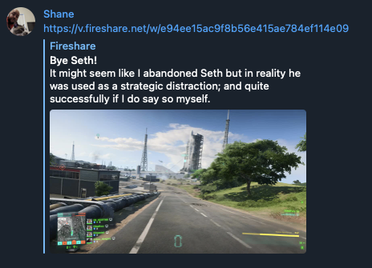

<!-- PROJECT LOGO -->
<br />
<p align="center">
  <a href="https://github.com/ShaneIsrael/fireshare">
    
  </a>

  <h1 align="center">Fireshare</h1>

  <p align="center">
    Share your game clips, videos, or other media via unique links.
    <br />
    <br />
    <a href="https://github.com/shaneisrael/fireshare/actions">
      
    </a>
    <a href="https://hub.docker.com/r/shaneisrael/fireshare">
      
    </a>
    <a href="https://hub.docker.com/r/shaneisrael/fireshare/tags?page=1&ordering=last_updated">
      
    </a>
    <a href="https://github.com/shaneisrael/fireshare/stargazers">
      
    </a>
    <br />
    <br />
    <a href="https://v.fireshare.net">Live Demo</a>
    ·
    <a href="https://github.com/ShaneIsrael/fireshare/issues">Report a Bug</a>
    ·
    <a href="https://www.paypal.com/paypalme/shaneisrael">Buy us a Coffee!</a>
  </p>
</p>

## Key Features

- Share videos through unique links
- Public / Private feeds (private is link only)
- Game-based organization with cover art
- Uploads (optional, can be restricted)
- Video view counting
- Open Graph metadata for rich link previews
- RSS feed for new public videos
- LDAP support
- Optional video transcoding with CPU or NVIDIA GPU

<h3 align="center">Dashboard</h3>

---

![card-view][card-view]

<h3 align="center">Automatic Game Organization</h3>

---

![folders][folders]

<h3 align="center">Open Graph Support</h3>

---

<center></center>

## Installation

Fireshare is designed to run in Docker.

Required mounts:

1. `/data` - internal database
2. `/processed` - generated metadata (posters, metadata files)
3. `/videos` - source video directory to scan

If your clips are in `/path/to/my_game_clips/`, mount that path to `/videos` in the container.

### Docker Compose

Edit `docker-compose.yml` for your host paths and admin credentials, then run:

```sh
docker-compose up -d
```

Then open `http://localhost:8080`.

### Docker Run

```sh
docker run --name fireshare \
  -v $(pwd)/fireshare:/data:rw \
  -v $(pwd)/fireshare_processed:/processed:rw \
  -v /path/to/my_game_clips:/videos:rw \
  -p 8080:80 \
  -e ADMIN_PASSWORD=your-admin-password \
  -d shaneisrael/fireshare:latest
```

Open `http://localhost:8080`.

## Configuration
- LDAP setup: [LDAP.md](./LDAP.md)

### Transcoding (Optional)

Transcoding is off by default.

```yaml
ENABLE_TRANSCODING=true
TRANSCODE_GPU=true # optional, NVIDIA only
```

CPU transcoding works out of the box. For NVIDIA GPU setup with the Docker image, you only need an NVIDIA GPU on the host—the image handles drivers and toolkit.

#### GPU Requirements

- NVIDIA GPU with NVENC support

#### Unraid Setup

If you're using Unraid:

1. Install "NVIDIA Driver" plugin from Apps/Community Applications
2. Add to Fireshare container environment:
   ```
   ENABLE_TRANSCODING=true
   TRANSCODE_GPU=true
   NVIDIA_DRIVER_CAPABILITIES=all
   ```
3. Add to "Extra Parameters": `--gpus=all`

#### Encoder Selection

When GPU mode is enabled, Fireshare selects the best available encoder:

**GPU Mode** (`TRANSCODE_GPU=true`):

- AV1 with GPU (av1_nvenc) — RTX 40 series or newer
- H.264 with GPU (h264_nvenc) — GTX 1050+
- Fallback to CPU encoders if GPU encoding fails

**CPU Mode** (`TRANSCODE_GPU=false`):

- H.264 with CPU — Most compatible, faster encoding
- AV1 with CPU — Best compression, slower

## Local Development

Requirements: Python 3, Node.js, and npm.

1. Clone the repo:
   ```sh
   git clone https://github.com/ShaneIsrael/fireshare.git
   ```
2. Start backend services from project root:
   ```sh
   ./run_local.sh
   ```
3. Start frontend:
   ```sh
   cd app/client
   npm install
   npm start
   ```
4. Open `http://localhost:3000` and sign in with `admin/admin`.

## Contributing

Contributions are welcome. For larger changes, open an issue first to align on scope.

1. Fork the repository
2. Create a branch from `develop`
3. Commit your changes
4. Rebase on latest `develop`
5. Open a pull request to `develop`

Issues and feature requests: https://github.com/ShaneIsrael/fireshare/issues

### Database Changes

If you update models, create a migration and review it before opening a pull request.

## Troubleshooting

### Playback Problems

If playback is unstable:

- Reduce source file size/bitrate
- Verify upload bandwidth on the host
- Prefer browser-friendly formats (MP4/H.264 is safest)
- Consider enabling transcoding for better compatibility
- Test in another browser to rule out codec/browser limitations

### Upload Fails Behind Nginx

Increase proxy limits/timeouts, for example:

```nginx
client_max_body_size 0;
proxy_read_timeout 999999s;
```

If you use a different proxy, apply equivalent upload size and timeout settings there.

---

[card-view]: .github/images/card-view.png
[folders]: .github/images/folders.png
